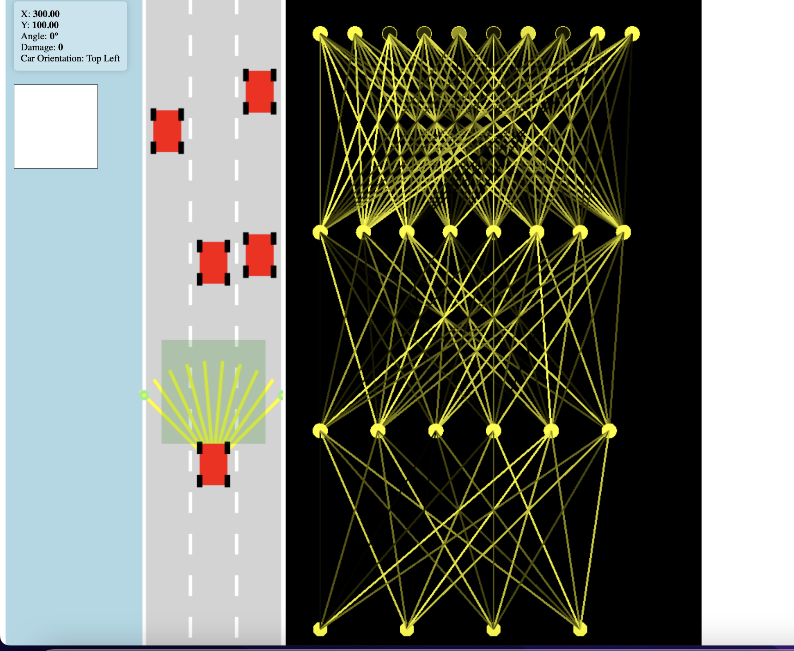

# Self-Driving Car with Neural Network Visualization

This project is a self-driving car simulation that incorporates a neural network for decision-making and provides visualization of the network's behavior. The car can navigate its environment autonomously using the neural network.I am working on a spacial graph for the car to traverse. This is also inspired by Radu. 

## Getting Started

To run the project, follow these simple steps:

1. Clone or download this repository to your local machine.

2. Navigate to the project's root directory.

3. Open the `index.html` file in your preferred web browser.

## Controls

Use the directional keys on your keyboard to control the self-driving car. You can control the car's movements using the following keys:

- `Up Arrow`: Move the car forward.
- `Down Arrow`: Move the car backward.
- `Left Arrow`: Steer the car to the left.
- `Right Arrow`: Steer the car to the right.

## Features

- Self-driving car simulation: Watch the self-driving car navigate the environment autonomously.
- Neural network visualization: View the neural network's decision-making process in real-time.
- Keyboard controls: Interact with the simulation using directional keys.

## Technologies Used

- Neural network: The project employs a neural network for decision-making.
- JavaScript: The code is written in JavaScript.
- HTML/CSS: The user interface is built with HTML and CSS.

## Author

- Robin Kelmen
- kelmenr@gmail.com

## License

MIT I guess. 

## Acknowledgments

- Radu https://www.youtube.com/@Radu Learning about JS, HTML and CSS and how to structure JS projects. Best Teacher
- 3Blue1Brown https://www.youtube.com/@3blue1brown Learning about the Essence of Linear Algebra and how Neural Networks work.

Enjoy experimenting with the self-driving car and neural network visualization!

